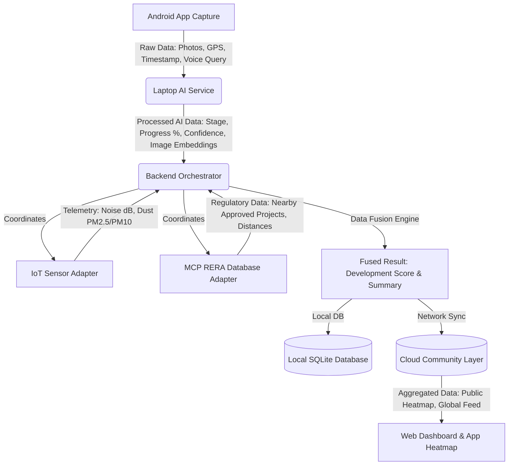

# LandSense AI

A multi-device platform including a Mobile App, Snapdragon X laptop, IoT hardware, Cloud, and Web Dashboard. **Built entirely on the Qualcomm tech stack and optimized for Qualcomm devices**, LandSense AI is a ***truly Multiverse project*** that predicts and tracks the development of land.

LandSense AI is a crowdsourced platform that takes the following inputs:
1. Photos from a mobile phone
2. GPS location from a mobile phone
3. Sound and dust sensor data from IoT devices
4. Construction data from RERA 
5. Historical data from other users stored in the cloud

And computes the following outputs:
1. Construction Stage
2. Confidence Score
3. Historical Context
4. Noise Levels
5. Dust Levels (PM2.5/PM10)
6. RERA Verification Status

These inputs and outputs are fused to generate a **Development Score** quantifying the progress of the development on that construction site.

The intended product flow is simple:

```text
Android phone captures photos + GPS 
        |
        v
Laptop backend receives the scan
        |
        v
Laptop AI service preprocesses/analyzes images
        |
        v
Backend fuses AI + RERA + IoT + cloud/history context
        |
        v
Cloud stores processed community observations
        |
        v
Android displays report + heatmap + nearby history
```

## Tech Stack & Data Flow

- **Android Phone**: Uses a TensorFlow Lite (Vision v2) model to process the image locally. GPS is recorded for heatmap plotting.
- **Snapdragon X Laptop**: Runs a LiteRT VLM + Gemma 4 model for deep image preprocessing when the user requests higher accuracy than the phone's on-device model. The laptop receives both the raw images and the initial descriptions.
- **Arduino (IoT)**: Monitors live noise and dust levels at the construction site. This telemetry is grouped into a cluster alongside the image descriptions and GPS coordinates.
- **RERA Integration**: RERA data of the nearest construction project is fetched using the GPS coordinates and added to the cluster.
- **Cirrascale LLM**: The full cluster is pushed to a Cirrascale Llama 3 model, which evaluates historical data and assigns a smart Development Score.
- **Community Cloud**: The final output from Cirrascale is saved in the cloud for future users. The GPS coordinates are plotted to form a public heatmap of development in the area.

**Tech Stack**- 
**mobile** - LiteRT vision 2 TFLite model 
**laptop** - LiteRT VLM + Gemma 4 model , GENIE x, Gemma gguf Quantized, 
**cloud** - SQLite , Cirrascale 
**Aurdino** - KY-037 (dust sensor), p.25 (dust sensor)


### Project file structure + Detailed description

```text
mobile/    Native Android app (Kotlin, Compose, CameraX, LiteRT for on-device ML)
ai/        Laptop VLM service (FastVLM / Snapdragon NPU for image processing)
backend/   Orchestrator, data fusion, and local SQLite DB for historical/RERA data
cloud/     Community intelligence service, heatmap, and history APIs
iot/       Simulated/live Arduino serial adapter for sound/dust telemetry
mcp/       RERA simulator for mock regulatory lookup
web/       Static browser dashboard for visualizing the community heatmap
scripts/   Test and demo runners for the various microservices
```
This microservice architecture ensures heavy inference remains on the laptop/backend while the mobile device efficiently focuses on data capture and local feedback.


## Branch Commands

Use these commands to switch to and inspect the integration branch.

```bash
git fetch origin
git switch AI-VLM
```

If the local branch does not exist yet:

```bash
git switch --track origin/AI-VLM
```

Check branch status:

```bash
git status --short --branch
git log --oneline --decorate -8
```

See what changed against the backend/cloud branch:

```bash
git diff --stat cloud+backend...AI-VLM
```

List project files:

```bash
rg --files
```

## Run and Check Everything

Install dependencies:

```bash
pip install -r requirements.txt
```

Compile-check Python files:

```bash
python -m compileall backend ai cloud iot mcp scripts
```

Start all local services:

```bash
python scripts/run_all.py
```

Service URLs:

```text
Backend:       http://localhost:8000
AI service:    http://localhost:8001
IoT service:   http://localhost:8002
Cloud service: http://localhost:8003
MCP service:   http://localhost:8004
Dashboard:     http://localhost:8080
```

Check backend:

```bash
curl http://localhost:8000/health
```

Check AI service:

```bash
curl http://localhost:8001/health
```

Run a simulated scan:

```bash
python scripts/simulate_scan.py
```

Run backend/cloud integration test:

```bash
python scripts/test_backend_cloud_integration.py
```

## Imported IoT + MCP REST Service

The `mcp+IoT` branch is integrated as a root-level FastAPI service. It exposes a
stable sensor/RERA contract through `main.py`, `routes/`, `services/`,
`adapters/`, `interfaces/`, `models/`, `config/`, and `data/mock_rera.json`.

Run it directly when you want to test that service by itself:

```bash
uvicorn main:app --reload --host 0.0.0.0 --port 8010
```

Useful endpoints:

```text
GET /status
GET /sensor
GET /rera
GET /nearby_projects
GET /project/{id}
```

By default it uses demo/mock mode from `.env.example`: `SENSOR_MODE=demo` and
`RERA_MODE=mock`. Mock RERA data is stored in `data/mock_rera.json`. To use a
real Arduino, set `SENSOR_MODE=live` and configure `ARDUINO_PORT` for the
machine, for example `COM3` on Windows.

## Android Input Contract

Android sends only capture data to the laptop backend.

Endpoint:

```text
POST http://<LAPTOP_IP>:8000/observation
```

Required fields:

- `timestamp`: UTC ISO 8601 string.
- `latitude`: phone GPS latitude.
- `longitude`: phone GPS longitude.
- `images`: Base64 image strings or `data:image/jpeg;base64,...` strings.

Optional fields:

- `owner_id`: local user/device/session ID for private history filtering.
- `voice_query`: optional text or voice-to-text query.
- `noise_db`, `dust_pm25`, `dust_pm10`, `sensor_timestamp`: optional device-supplied sensor values. Android does not need these for the first version.

Example request:

```json
{
  "timestamp": "2026-07-09T10:30:00Z",
  "owner_id": "android-demo-device-001",
  "latitude": 12.9716,
  "longitude": 77.7500,
  "images": [
    "data:image/jpeg;base64,/9j/4AAQSkZJRgABAQ..."
  ],
  "voice_query": "Check whether this construction site is active."
}
```

## Backend Output Contract

Example response:

```json
{
  "observation_id": "uuid-string",
  "timestamp": "2026-07-09T10:30:00Z",
  "latitude": 12.9716,
  "longitude": 77.7500,
  "images": [],
  "voice_query": "Check whether this construction site is active.",
  "construction_stage": "Structural Work",
  "confidence": 0.88,
  "progress": 55.0,
  "noise_db": 74.2,
  "dust_pm25": 38.5,
  "dust_pm10": 79.1,
  "sensor_status": "connected",
  "rera_projects": [
    {
      "name": "Prestige Kings County",
      "builder": "Prestige Group",
      "status": "Approved",
      "distance": 120.5
    }
  ],
  "development_score": 80.0,
  "summary": "Structural Work is estimated at 55% progress. Nearby verified RERA approval (+15 pts).",
  "embedding": [0.01, 0.02, 0.03]
}
```

Android should show:

- Construction stage.
- Progress percentage.
- Confidence.
- Development score.
- Summary.
- Sensor status.
- Noise dB.
- Dust PM2.5 and PM10.
- RERA/project matches.
- Observation ID.
- Timestamp.
- GPS coordinates.

If a value is `null`, show `Unavailable`.

## Heatmap and History for Android

Backend health:

```text
GET http://<LAPTOP_IP>:8000/health
```

Current user's history:

```text
GET http://<LAPTOP_IP>:8000/history?owner_id=<OWNER_ID>
```

Public heatmap:

```text
GET http://<LAPTOP_IP>:8000/heatmap
```

Nearby local RERA/demo projects:

```text
GET http://<LAPTOP_IP>:8000/nearby?latitude=12.9716&longitude=77.7500&radius=500
```

Heatmap points can be colored by `development_score`:

- `0-30`: low activity.
- `31-60`: medium activity.
- `61-100`: high activity.

## Detailed Flowchart & Data Lifecycle

The following flowchart illustrates the step-by-step lifecycle of a single construction scan and the data extracted at each phase:



### Data at Each Step:
1. **Capture Phase (Mobile):** Generates `Base64/JPEG Images`, `Latitude/Longitude`, `UTC Timestamp`, and optional `Voice Transcripts`.
2. **AI Processing Phase (Laptop/Cloud):** Extracts visual intelligence including `Construction Stage` (e.g., Excavation, Structural), `Progress Percentage`, and `Visual Confidence Score`.
3. **IoT & MCP Context Phase (Backend):** Correlates spatial data to retrieve live `Noise (dB)`, `Dust (PM2.5/PM10)`, and matches the site with `RERA Approved/Rejected Projects`.
4. **Data Fusion Phase:** Synthesizes all inputs into a final `Development Score (0-100)` and an `Explainable AI Summary`.
5. **Community Phase:** Data is stripped of PII (Private Identifiable Information) and pushed to the public cloud to feed the `Global Heatmap` and `Dashboard Analytics`.

## Project Impact & Use Cases

LandSense AI bridges the gap between digital vision, physical sensors, and regulatory compliance. It transforms unstructured urban visual data into structured, actionable intelligence.

### How It Is Useful (Uses for the People):
- **For Citizens & Homebuyers:** Buyers can simply snap a picture of a construction site to instantly know if it's legally approved by RERA, see how much progress has been made, and verify if the builder is meeting environmental standards (noise/dust limits).
- **For City Planners & Regulators:** Municipalities get a real-time, community-sourced heatmap of urban development. They can identify illegal, unapproved construction zones or sites that are violating pollution norms without sending inspectors everywhere.
- **For Builders & Contractors:** Developers can maintain a transparent, timestamped visual ledger of their progress, correlating it with IoT sensors to prove compliance with environmental regulations.
- **For Environmental Agencies:** Provides a live map correlating heavy construction activity with localized spikes in dust (PM2.5) and noise pollution, enabling targeted interventions.

## How to Extend This Project

The modular microservice architecture makes it incredibly easy to extend:
1. **Satellite Imagery Integration:** The `ai/` service could be expanded to process satellite feeds alongside mobile photos to track large-scale land changes automatically.
2. **Drone Deployments:** The Android input layer can be replaced or augmented with automated drone fleets uploading real-time aerial feeds to the `/observation` endpoint.
3. **Advanced IoT Hardware:** The simulated Arduino adapter can be swapped for a fleet of industrial-grade LoRaWAN environmental sensors deployed across smart cities.
4. **Blockchain / Smart Contracts:** The `Development Score` and `Progress %` can be piped into a smart contract to automatically release escrow funds to builders when construction hits verifiable milestones.
5. **Predictive AI:** Extend the cloud layer to use historical timeline data (image embeddings + timestamps) to predict *when* a project will be completed, flagging potential delays before they happen.

## Current Architecture

```text
Android App
  Jetpack Compose UI
  CameraX photos
  GPS coordinates
  UTC timestamp
  optional speech query
  lightweight on-device TFLite stage hint
        |
        | POST /observation
        v
Backend Orchestrator
  validates ObservationInput
  creates observation ID
  calls AIAdapter
        |
        v
AI Service
  decodes Base64/data URL image
  resizes image
  extracts visual features
  estimates stage/progress/confidence
  returns embedding
        |
        v
Backend Fusion Pipeline
  gets IoT telemetry
  correlates by time and distance
  gets nearby RERA records
  calculates development score
  writes local SQLite history
  sends processed data to cloud
        |
        v
Cloud Community Layer
  stores observations
  serves heatmap
  serves history/latest sensor data
        |
        v
Android App
  displays report
  caches successful observations in Room
  displays OSMDroid heatmap/history/chat
```

## Android Mobile App

Implemented stack:

- Kotlin.
- Jetpack Compose + Material 3.
- CameraX.
- FusedLocationProviderClient.
- Retrofit + OkHttp + kotlinx serialization.
- Coroutines.
- Hilt dependency injection.
- Room local cache.
- OSMDroid/OpenStreetMap heatmap.
- Android Speech Recognizer for optional voice queries.
- TensorFlow Lite Task Vision local classifier.
- MVVM with repository/data layers.

Implemented screens:

- Splash and onboarding.
- Home dashboard with backend status, total scans, average development score, and quick actions.
- Capture screen with live CameraX preview, permission request, 1-4 photo capture, thumbnail removal, optional speech query, local AI prediction display, GPS lookup, and upload progress.
- Result screen with construction stage, progress, confidence, development score, IoT noise/dust, sensor status, RERA matches, AI summary, metadata, and Android share sheet.
- History screen backed by `/history?owner_id=...` with Room fallback.
- Community heatmap using `/heatmap`, OSMDroid circles/markers, list view, and All/Heavy/Standard/Completed filters.
- Chat assistant screen using `POST /chat`.
- Settings screen for laptop LAN IP. Enter only the IP address; the app rewrites requests to `http://<IP>:8000`.

Image handling:

- Resize longest side to around 1024 px.
- JPEG quality around 70-80.
- Encode as `data:image/jpeg;base64,...`.
- Support up to four captured images.

Network notes:

- Phone and laptop must be on the same Wi-Fi.
- Android must use the laptop LAN IP, not `localhost`.
- Example: `http://192.168.1.10:8000`.

Rules:

- Android talks only to backend.
- Android must not call AI, IoT, MCP, or cloud services directly.
- Raw images go to laptop backend/AI only.
- Cloud receives processed observations, not raw images.
- On-device TFLite classification is local feedback only; final report fields come from backend fusion.

## Project Structure

```text
ai/
  engine.py            Laptop-side image preprocessing/inference boundary
  main.py              AI FastAPI service

backend/
  api/                 Backend REST routes
  adapters/            AI, IoT, MCP, cloud adapters
  database/            SQLite setup and RERA seed data
  fusion/              Correlation and scoring
  models/              Pydantic and SQLAlchemy models
  pipeline/            Observation orchestration

cloud/                 Community history, heatmap, latest sensor, chat hooks
iot/                   Arduino telemetry simulator
mcp/                   MCP/RERA simulator
mobile/                Native Android app
  app/src/main/java/com/landsense/ai/
    ui/screens/        Compose screens for home, capture, result, history, heatmap, chat, settings
    presentation/      ViewModels and UI state
    data/network/      Retrofit API models/service
    data/local/        Room cache
    data/repository/   Observation and settings repositories
    util/              GPS, network, and on-device classifier helpers
web/                   Browser demo dashboard
scripts/               Run/test/demo helpers
docs/                  Architecture and API docs
```

## Known Cleanup Items

- `mobile/local.properties` is machine-specific and should not be committed.
- `cloud_data.db` may appear as an untracked local runtime database.
- The AI engine is Snapdragon NPU + OpenCV. Prediction works fully offline using the local VLM.
- Invalid Android images currently fall back to mock AI output through the adapter; for production, invalid images should return a clear validation error.
- The mobile heatmap uses OSMDroid/OpenStreetMap, so no Google Maps key is required.

